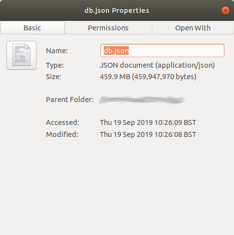
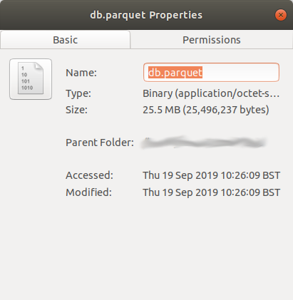

# json-to-parquet

This is a quick and dirty  example I used to demo how much compression there is using `parquet` instead of `json`.

* Uses `gzip` compression, because I couldn't be bothered to deal with the problems people have with naming conflict when using `snappy`.
* There's no schema. Again, not needed in this case.

The file `db.json` is a database dump of 129K documents from `mongodb`.

 

